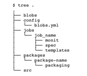

# BOSH Releases 

BOSH release are self contained and provide very specific software that solely relating to the
purpose of that release. E.g. 
* In the case of Redis the release will have the following: 
	* startup and shut down scripts for the Redis software 
	* the tar ball of the soruce code, configurations needed to run Redis. 
	* configuration files that the operators can use to configure the software. 

The main reason to have a release it to have the same version of software being installed on a
machine rather than running the apt-get which may deploy different software depending on the time
when the command was run. Therefore Release is a collection of carefully curated software which are
tested and are insured to run without an issue. 
Another thing to note is that the release is self contained and you can roll out the release even
without an internet access. 

Cloud Foundry release are defined in a separate github repository
[cf-deployment](https://github.com/cloudfoundry/cf-deployment) . The release will list all the
versions of components like diego cell, go router, cloud controller, uaa that work together and are
tested. 

## Anatomy of a BOSH Release 

A bosh release has 5 primitives and they are: 
1. jobs directory 
2. packages directory 
3. config, src and blobs directory 
4. .dev_builds and .final_builds 
5. any GIT subdirectory 

In order to start making a new release with bosh the following commands have to be run. 
```
$ bosh ini-release <releas-name> 
$ cd <release-name> 
$ bosh generate-job <job-name> 
$ bosh generate-package <package-name> 
```

The following tree structure is created in a BOSH release 
 

### Jobs 
A BOSH release job conceptually describes a single component. You can run a job in isolation and it
will work. The job can comprise of several processes (master and a worker process for log rotation).
The release job can be dependent on other jobs and it may have several steps when running, but at
the end it should be a single component that can be started and stopped by a single Monit script. 

*A release job are individual software component that can run in isolation. An instance group on
the other hand is the deployment unit for jobs. A single instance group represents one or more
release jobs to be deployed on a single VM. An instance group can have several running instances
(VM) for HA* 

 A BOSH releases for each component of Cloud Foundry (Cloud Controller, GoRouter) is broken down into 
one or more jobs. Each job as we can see in the diagram above will have a monit, spec script as well
as a template folder. Each job has to be able to start and stop its process and this is generally
done by the control and monit script. 

**Control Script** 
Contorl scripts are ones that have the start and stop commands for the job. They are present in the
template folder under the following file name `<job-name>ctl.erb`. This file is generated at the
time of deployment and placed to `/var/vcap/jobs/<job-name>` file in the VM. 
If the job needs templates other than the control script they will be placed in the template folder
and will be generated in the same way as control scripts. 
The logs for the jobs will be placed under the `/var/vcap/sys/log/<job-name>`

**Monit Script** 
Monit scripts are ones that will control and monitor the processes that are started. The monit file
has the following anatomy. 

```
check process <job_name> 
	with pid /var/vcap/sys/run/<job_name>/pid 
	start program "/var/vcap/jobs/<job_name>/bin/ctl start"
	stop program "/var/vcap/jobs/<job_name>/bin/ctl stop" 
	group vcap 
``` 

**Spec file** 
This is the one that holds the jon meta data information like additional template file. and reguired
job properties like say db_password etc. The file will have 
* name 
* packages - package dependency as well packages created by this job. 
* templates - templates other than the control script template that are needed. 
* properties - the properties that his job needs to run


### Packages 

packages are directory that contain the dependency of a specific job. These dependencies are pulled
from either the blob or the src folder. The package folder wil have two files in them for each
depenency e.g. `golang-1.10` folder will have: 
* packaging- is generally a shell script that will package the src folder to a package or it can
  handle blobs as well if the dependency is a blob
* spec - the spec file gives the location where we can find either the blob or source code needed
  for packaging. 

There are two types of dependencies they are runtime and compile time. The packages also mention
other packages that they are dependent on. 

**Src, blobs and blobstore** 

The src folder in the bosh release contains source code for dependency to a job. The src folder in
the release can be copied to the folder or can be referred to the src folder as a git sub module. 

Most of the releases are highly dependent on src code and therefore this folder will have the most
code we need. However we can also have tar files or blobs that are already packages and stored in
the blobs folder. The components that are not actually your software code can be added to the blobs
folder (e.g. ruby binary) 

*Source code vs binaries - it is always better to have source code in the src folder and have a
packaging script that builds the dependency when we need it because there can be situation where a
blob may work on a OS distribution and not work in another.* 

Once the release tar ball has been prepared BOSH needs to upload the release package to either a
local repo (in case of a dev build) or a release blobstore (generally on the director) in case of
final builds. 

The whole packaging and building process for a job is only needed when you have a new component that
you need to deploy on a VM using BOSH if we need to use the release of a CF componet we can use the
release files from git and then 
```
$ bosh -c <env> upload-release releases/cf-x.yml 
```
This will take the release from the github location and upload to BOSH director. 

[Next](3-bosh-deployments.md) 
